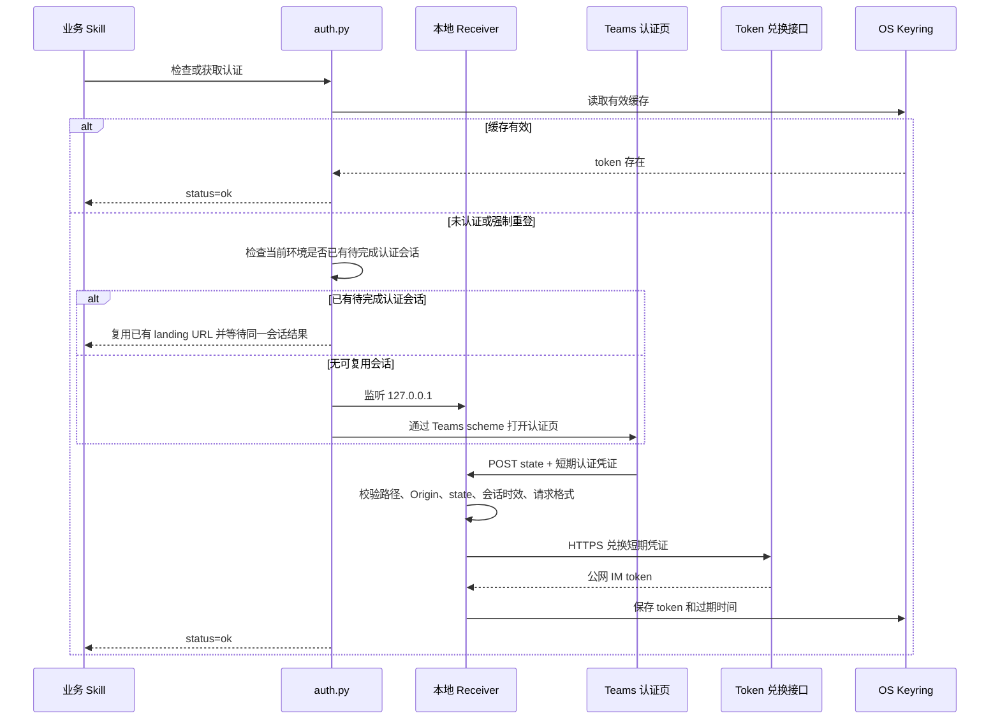

# IM Teams Auth 架构与执行逻辑

> 本文档面向维护者，描述 `im-teams-auth` 的组件职责、认证流程、调用契约和安全边界。
> 面向最终用户时，不应展示环境名、token、Keyring 位置或内部配置。

配套文档：

- [CAPABILITIES.md](./CAPABILITIES.md)：面向使用者和调用方的简明能力清单。
- 本文档：面向维护者的实现流程和安全设计。

## 一、目标与边界

`im-teams-auth` 是业务 skill 共用的认证能力。它负责检查认证状态、拉起 Teams 认证、接收短期认证凭证、兑换公网 IM token、安全缓存凭证，并以稳定状态返回给调用方。

它不负责：

- 处理任何具体业务请求。
- 决定业务流程在认证后执行什么动作。
- 在认证页或本地 receiver 之间传输长期 token。
- 让业务 skill 自行定义认证条件、兜底链接或提示规则。

## 二、组件职责

| 文件 | 职责 |
|------|------|
| `scripts/auth.py` | 认证状态检查、认证拉起、本地 receiver、短期凭证兑换、会话编排和结果输出 |
| `scripts/credential_store.py` | token 命名、Keyring 读写、过期判断和清理 |
| `scripts/session_store.py` | 待完成认证会话的文件锁、读写、复用判定与时效计算 |
| `scripts/runtime.py` | 日志初始化和 `keyring` 依赖检测、安装 |
| `scripts/env_check.py` | Python、平台和 `keyring` 环境检测 |
| `scripts/config.py` | URL、scheme、端口、超时、Keyring 名称等静态配置 |

## 三、能力入口

| 动作 | 入口 | 结果 |
|------|------|------|
| 环境检测 | `python3 scripts/env_check.py` | 输出 Python、平台和 `keyring` 检测结果 |
| 检查认证 | `python3 scripts/auth.py --check` | 有有效凭证返回成功，否则返回未认证 |
| 登录认证 | `python3 scripts/auth.py` | 复用缓存或拉起认证 |
| 强制认证 | `python3 scripts/auth.py --no-cache` | 清除当前 Keyring 缓存并重新认证 |
| 清除当前凭证 | `python3 scripts/auth.py --clear` | 清除当前 Keyring token 和过期时间 |
| 清除全部凭证 | `python3 scripts/auth.py --clear-all` | 清除全部已配置环境的 Keyring 凭证 |

`--landing-url`、`--open-url-directly`、`--port`、`--timeout` 和 `--verbose` 属于开发调试能力，不应作为业务 skill 的常规调用方式。

## 四、认证流程



关键原则：

- 浏览器页面不能直接写 OS Keyring，因此由本地脚本完成长期 token 兑换和存储。
- 页面只回传短期认证凭证，长期 token 不经过页面到 receiver 的链路。
- receiver 是一次性的，成功、失败或超时后退出。
- **认证等待超时默认 120s**（`RECEIVER_TIMEOUT_SECONDS`，可用 `--timeout` 覆盖）：本地 receiver 等用户完成授权回传 token 的最长时间，即 `--wait` 的最长阻塞时长；短期凭证兑换 token 的 HTTPS 请求另有独立的 15s 超时，receiver 复用判定的 TCP 探活为 0.5s。
- 认证页 URL 会带 `request_expires_at`，其值与本地等待超时一致，用于约束本次认证会话的有效期。
- 同一环境同一时刻只允许存在一个待完成认证会话；未超时前必须复用原有链接和 receiver。

## 五、本地 Receiver 契约

| 项目 | 约束 |
|------|------|
| 监听地址 | 仅 `127.0.0.1` |
| 端口 | 仅 `35101-35110` |
| 路径 | 仅 `/token` |
| Method | `POST`，并支持 CORS 预检 `OPTIONS` |
| Content-Type | `application/json` |
| 请求体上限 | 16 KiB |
| Origin | 必须与认证落地页 Origin 一致 |
| state | 必须与本次认证生成的一次性随机值一致 |
| 会话时效 | 不得晚于 URL 中的 `request_expires_at` |
| 窗口 ID | `win_id` 固定等于 `session_id` |

认证页 POST 数据（只回传 `state` 和 `encrypt`；token 过期时间由脚本侧默认 7 天，页面不回传 `expiresAt`，脚本仍兼容传入但页面不发送）：

```json
{
  "state": "一次性 state",
  "encrypt": "短期认证凭证"
}
```

## 六、凭证读取与存储

凭证读取优先级：

1. 对应环境的 token 环境变量。
2. 对应环境的 OS Keyring 凭证。

Keyring 同时存储 token 和过期时间。没有有效过期时间、已过期或读取失败时，凭证视为不可用。默认缓存有效期为 7 天；认证结果提供有效时间时，使用有效的认证结果时间。

清理操作只处理 Keyring。若调用进程设置了环境变量 token，脚本会返回警告，但不会修改外部环境变量。

## 七、调用方契约

认证结果使用 JSON 状态和退出码表达：

| 退出码 | 含义 | 调用方处理 |
|--------|------|------------|
| `0` | 成功 | 继续原业务流程 |
| `1` | 认证或运行失败 | 展示错误并中断当前业务动作 |
| `4` | 未认证、认证过期或等待认证超时 | 按认证结果和提示决定是否等待用户操作 |

认证拉起后输出三种链接（`--start` 的 `pending` 输出；直跑流程的成功/失败 JSON 与 stderr 同样含 `appLinkUrl`），发给用户的规则：

| 字段 | 形式 | 是否发用户 | 用途 |
|------|------|-----------|------|
| `appLinkUrl` | `https://<im 或 sit-im>/applink/link?url=...` | **是，必发** | 「在 Teams 中打开认证」，任何对话客户端可点开并拉起 Teams |
| `schemeUrl` | `teamssit://`/`sk360teams://applink/...` | **否** | 仅脚本内部 `webbrowser.open` 自动拉起（整个会话仅一次），多数客户端点不开 |
| `landingUrl` | https 落地页（仅测试环境输出） | 输出包含时附加 | 「在浏览器中打开认证」，浏览器直开 |

> 自动拉起用 scheme、整个会话仅一次；给用户手动点的是 `appLinkUrl`。生产只给 `appLinkUrl`，测试额外给 `landingUrl`。

调用方必须遵守：

- 只消费认证结果，不复制或改写认证策略。
- 不展示完整 token、请求头或 Keyring 内部信息。
- 收到认证链接（`appLinkUrl`）时及时展示给用户；`schemeUrl` 仅供脚本内部自动拉起，不展示。
- 认证链接默认是并行提示；只有认证命令已经结束并明确要求中断时，才暂停业务流程。
- 认证成功后重试或继续原业务动作。

## 八、安全设计

- receiver 只监听回环地址，避免对局域网或公网暴露。
- 固定端口范围和路径，限制攻击面。
- 使用一次性随机 `state` 防止伪造回传。
- 使用与等待超时一致的 `request_expires_at` 约束链接有效期。
- 使用严格 `Origin` 校验限制允许的认证页来源。
- 只接受 JSON，并限制请求体大小。
- 短期认证凭证通过 HTTPS 兑换。
- 长期 token 仅保存在环境变量或 OS Keyring，不写明文文件。
- 日志不记录 token。
- receiver 超时自动退出。

## 九、状态速查

| status | 含义 |
|--------|------|
| `ok` | 已认证、认证成功或清理成功 |
| `expired` | 未认证、认证过期或等待认证超时 |
| `error` | 环境、Keyring、receiver、兑换或其他运行错误 |

## 十、维护检查

修改认证能力后至少检查：

- 文档中的命令参数与 `auth.py --help` 一致。
- receiver 仍只监听回环地址、受限端口和固定路径。
- `Origin`、`state`、会话时效、请求格式和请求体大小校验未被绕过。
- token 未出现在页面回传、日志或明文文件中。
- 退出码 `0`、`1`、`4` 的含义保持稳定。
- 调用方仍可区分成功、失败和未认证状态。
