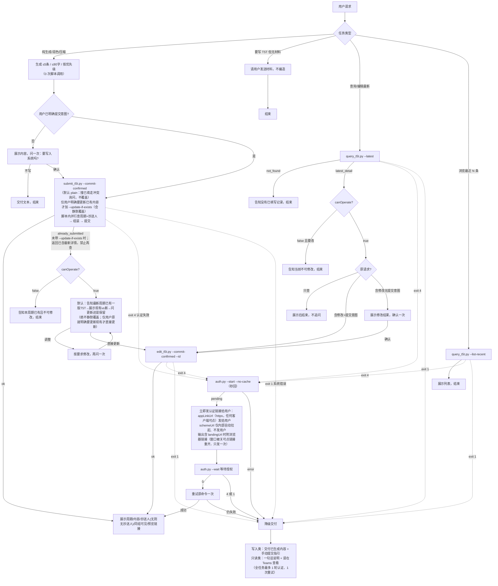

# T5T Skill 执行逻辑文档

> 本文档描述 `im-teams-t5t` 的完整执行逻辑，以及它内置的认证子模块（`scripts/auth/`）流程。
> 仅作开发参考；面向最终用户时禁止暴露环境名、token、Keyring 等内部细节。

配套文档：

- [CAPABILITIES.md](./CAPABILITIES.md)：面向使用者和调用方的简明能力清单。
- 本文档：面向维护者的执行流程、接口、状态和约束说明。

---

## 一、总览

`im-teams-t5t` 把散乱材料收敛成「最多 5 条、每条 ≤80 字、按优先级排序」的工作重点（Top 5 Things），并在用户确认后写入 360Teams T5T 系统。

两类核心动作：

- **新建**：填写下周可填写周期的 T5T。
- **查询/编辑**：查询最新已填写 T5T，按需修改正文、删除抄送人或切换同组可见。

此外支持：

- 基于周报、会议纪要、项目进展、客户反馈等材料生成或优化 T5T。
- 只读分页浏览最近 T5T。
- 使用 JSON 参数或内容文件提供新建、编辑内容。
- 在正式提交前生成 dry-run 和确认哈希，防止确认后内容或权限发生变化。
- 提交成功后返回 T5T 预览链接。

所有系统调用都经过认证。认证由内置的认证子模块（`scripts/auth/`）完成，t5t 业务脚本只消费结果。

明确不支持：

- 无参考材料时编造 T5T。
- 修改非最新历史 T5T。
- 新建时新增、替换或构造抄送人。
- 编辑时新增、替换或修改抄送人对象；只允许删除已有抄送人。
- 跳过用户确认直接提交。

脚本分工：

| 脚本 | 职责 |
|------|------|
| `scripts/submit_t5t.py` | 查询可填写周期、新建 T5T |
| `scripts/query_t5t.py` | 只读查询：查最新已填写 T5T（`--latest`）、浏览最近列表（`--list-recent`） |
| `scripts/edit_t5t.py` | 提交编辑/更新已填写 T5T |
| `scripts/t5t_client.py` | 共享：认证、请求、解析、payload 组装、确认哈希（不可直接执行） |
| `scripts/config.py` | 静态配置：环境、域名、API 路径、Appkey、超时、依赖路径 |

> **运行前置（见 SKILL.md「运行前置」）**：每个任务先跑 `scripts/auth/env_check.py` 取 `python_path`，后续所有命令用该绝对路径（避开会截断中文参数的 VM shim、兼容沙箱 PATH 缺失）。本文示例里的 `python3` 仅作占位，实际用 `python_path`。

---

## 二、配置（`scripts/config.py`）

| 项 | 值 |
|----|----|
| 默认环境 | `production`（`ACTIVE_ENVIRONMENT`，可被环境变量 `T5T_ENV` 临时覆盖） |
| production 域名 | `https://im.360teams.com` |
| test 域名 | `https://sit-im.360teams.com` |
| API 前缀 | `/api/qfin-api` |
| Appkey | `t5t`（固定） |
| 业务接口请求超时 | 30s（`DEFAULT_REQUEST_TIMEOUT`，每次 HTTP 请求的超时，可用 `--timeout` 覆盖） |
| 认证失效退出码 | `4` |

> 这里的 30s 只是 t5t **业务接口单次 HTTP 请求**的超时，与「认证等待」无关。认证的等待超时（本地 receiver 等用户完成授权回传 token，默认 **120s**）由认证子模块控制，见其 `RECEIVER_TIMEOUT_SECONDS`；t5t 业务侧不发起认证、不持有该超时。

接口路径：

| 用途 | Method | Path |
|------|--------|------|
| 周期列表 | GET | `/dgt/tft/weekly/report/list/query` |
| 最新/最近已填写列表 | GET | `/dgt/tft/im/self?pageNum=<n>&pageSize=<size>`（查最新固定 1/1；浏览可放大 pageSize） |
| 按 id 查详情 | GET | `/dgt/tft/weekly/report/queryById/{id}` |
| 历史抄送人 | GET | `/dgt/tft/weekly/report/latest/copies` |
| 提交（新建+编辑共用） | POST | `/dgt/tft/weekly/report/commit` |
| 预览页 | — | `/applink/page/t5t?...`（applink scheme） |

统一网关错误码分类由 `scripts/auth/gateway_errors.py` 提供（认证子模块，跨脚本共享）：`is_auth_code`（401/403/100401/100403/10130/10220/10230/10241/10301/12001/12003/12004→认证失效，删 token 重认证）、`is_network_code`（408/502/504/9999→提示网络）；其余非 0 码按普通错误粗处理。

### 脚本关键参数速查

| 脚本 | 参数 | 作用 |
|------|------|------|
| submit | `--commit-confirmed` | 标准：查周期→组装→提交，一次完成（新建） |
| submit | `--update-if-exists` | 配合 commit：本周没填→新建，已填可改→就地更新，单进程搞定 |
| submit | `--report-id <id>` | 多周期（`period_choice`）时指定要写入的周期 |
| submit | `--validate-items` | 纯本地校验 `--items-json` 格式，不联网/不认证/不提交 |
| submit/edit | `--items-json '<JSON 数组>'` | 提交内容；**强制纯字符串数组** `["a","b"]`，≤5 条、每条 ≤80 字、无空串、不包对象 |
| submit/edit | `--open-preview` | 提交成功后返回预览链接 |
| submit/edit | `--invite-same-group true\|false` | 同组可见（不传：新建默认 true / 编辑保留原值） |
| query | `--latest` | 查最新详情（只读，不修改/不提交） |
| query | `--list-recent --page-size/--page-num` | 只读分页浏览最近 |
| edit | `--commit-confirmed --latest` | 一步更新最新单条：自动定位 id→核对→提交 |
| edit | `--commit-confirmed --id <id>` | 编辑指定 id |
| edit | `--to-list-json '<JSON>'` | 删抄送人（只能删，人数严格少于当前） |
| submit | `--check` | 只查能否提交（路径 E，只读，不生成/不写入） |
| 两者 | `--dry-run`/`--skip-confirmation` | 仅开发排查（见 §五/§六） |

> 提交命令在联网前已就地校验 `--items-json` 格式，格式错不联网就秒级返回，无需另跑 `--validate-items`。

---

## 三、内容生成阶段（不涉及系统调用）

1. **判断输入来源**
   - 有参考材料 → 基于材料提炼，不编造。
   - 只给已有 T5T → 按要求改，保留原意。
   - 无材料 → 建议补充数据来源，不直接生成。
2. **生成准则**（用户明确要求优先级最高，下列为未指定时的默认兜底，不得用默认削弱用户明确要求；唯一硬限是脚本的 ≤5 条 / ≤80 字 / 纯字符串数组格式）：最多 5 条 / 按优先级 / 真实客观 / 去琐碎；每条 ≤80 字。**润色到位**：写成完整、具体的一句话（说清进展/目标/卡点，书面得体，不甩干巴短词/半截短语）；真实客观——有成绩如实说、有问题也直接提不回避；润色只作用于表达层，不堆形容词/不夸大/不编造成果/不注水，信息照实、表达讲究。T5T 是工作重点、动作化表述（推进/建设/对接/完成/上线/优化）。按内容性质分两场景（别只认「润色」这个词，用户说改/调整/顺/精炼/换说法/帮我看看都算）：**A 加工现成内容**（给的是现有 T5T/条目）→ 保语意、不加料：只改表达，绝不改原意、不添油加醋，不凭空加原文没有的信息（「本周完成 X」「下周继续 Y」「推动试用」「收集反馈」等），不硬塞「本周→下周」结构，既不强转过去式也不编造未来动作，用户指定改某维度就只动那维度；**B 从素材生成**（给的是周报/纪要/进展）→ 提炼成工作重点、可从材料合理顺延但不编造材料毫无线索的事实。判不准按 A。承接「本周成果→下周动作」只在原文含跨周信息或用户明确要求时写。例（A）：原「探索 X 封装落地，覆盖 A/B/C，初步形成闭环」→ ✓「推进 X 封装与落地，覆盖 A/B/C，初步形成流程闭环」（理顺表达、信息不增减）；✗「本周完成 X，下周推动团队试用并收集反馈」（编造＝加料）。**一稿成型、不要墨迹**：直接写 1～5 条交付，不反复推翻重写/列多版草稿/来回自审；别手动数字数（长度脚本兜底），条数按材料真实支撑写（够 3 条就 3 条，不硬凑 5 条）。场景 B（从素材生成）下周动作从材料自然顺延不算编造；场景 A（加工现成内容）保语意、不加料、不编造（以上为准）。
3. **写入授权按 SKILL.md「提交意图与确认」执行**：用户已明确表达提交意图（“提交/写入/直接更新”等）→ 直接提交不再确认；只要求“生成/整理”→ 展示内容并确认一次；无提交意图 → 绝不自动写入。

校验在脚本侧强制（`t5t_client.extract_values`）：

- 超过 5 条 → 拒绝执行。
- 任一条 > 80 字 → 报错。
- 不足 5 条 → 提交时自动补空字符串（`_make_summary_items` 固定生成 5 项 `rawContent`）。

---

## 四、完整执行流程（标准路径：`--commit-confirmed` 一次完成）

用户授权或确认后，一次调用完成核对与提交；dry-run 两阶段（§五/§六的两阶段细节）仅用于开发排查。完整流程图：



> 内容是覆盖式更新（保留原抄送人/同组可见），但面向用户一律说“更新”，不说“覆盖/dry-run”。
> `--check` 仍可单独查周期，常规写入不需要（`--commit-confirmed` 已含周期检查）。

---

## 五、新建分支：两阶段兼容模式（仅开发排查用）

标准流程是 §四 的 `--commit-confirmed` 一次完成。新建也保留 dry-run + skip-confirmation 两阶段（仅开发排查或需人工核对 payload 时用，常规不走）：

1. `submit_t5t.py --dry-run --items-json '<JSON>'`：读缓存 token（未认证退 4）→ 重查周期（空则 `already_submitted` 中断、不提交）→ 查 `latest/copies` 抄送人 → 组装 `create` payload + `confirmationHash`，输出 `status: dry_run` / `mode: create` 立即中断。
2. 确认后 `submit_t5t.py --skip-confirmation --report-id '<reportId>' --confirmation-hash '<hash>' --open-preview --items-json '<同上 JSON>'` 提交。

约束：`--skip-confirmation` 缺 `--report-id`/`--confirmation-hash` 即拒绝；脚本重算 hash 不一致即中断（「已确认信息发生变化，请重新查询并确认」）；两次须同环境/内容/`reportId`/`confirmationHash`；传过 `--invite-same-group` 正式提交须带相同值；抄送人只能原样用 `latest/copies` 返回值，不接受新增/替换/构造。

---

## 六、查询编辑分支

> 标准流程：`query_t5t.py --latest` 查询后直接 `edit_t5t.py --commit-confirmed --id` 提交（见 §四 流程图）。只读查询走 `query_t5t.py`，编辑/提交走 `edit_t5t.py`。本节第二/三步的 dry-run 两阶段仅开发排查用。

### 第〇步（可选）：只读浏览最近 T5T

用户只想「看看最近 N 条」时：

```bash
python3 scripts/query_t5t.py --list-recent --page-size 5   # --page-num 默认 1
```

- 走 `query_self_weekly_list` → `/im/self?pageNum=<n>&pageSize=<size>`，经 `format_recent_item` 收敛成 `records`（`period`/`items`/`id`/`canOperate`），输出 `status: recent_list`。
- 纯只读，展示后结束。**修改仍只针对最新单条**，不基于列表历史条目改。

### 第一步：查询最新详情

```bash
python3 scripts/query_t5t.py --latest
```

脚本流程（`query_latest_detail`）：

1. GET `/im/self?pageNum=1&pageSize=1`（查最新固定 1/1）取第一条的 `id`。
2. GET `/queryById/{id}` 查详情。
3. 输出 `status: latest_detail` / `id` / 周期 / 内容 / `toList` / 权限 / `inviteSameGroupView` / `canOperate`（只输出编辑和展示需要的字段，不回显完整接口响应）。
4. 列表为空 → 输出 `not_found`。

代理展示周期、内容、权限、同组可见后分支：

- `canOperate=false` → **明确告诉用户「该 T5T 当前不可修改」，展示周期/内容/抄送人/同组可见即结束**，不进入编辑。
- `canOperate=true` → 询问是否修改内容、删除现有抄送人，或切换同组可见。
- 用户只查不改 → 展示后结束。

### 第二步：编辑规则（标准 `--commit-confirmed` 与 dry-run 通用）

`--id` 用详情返回的 `id`（或 `--latest` 自动定位最新单条）。三类修改可任意组合：

- 不传 `--items-json` 保留原内容；不传 `--to-list-json` 保留原抄送人；不传 `--invite-same-group` 保留原同组可见；三者都不传 → 脚本拒绝。
- 抄送人**只能删、不能加**（`validate_reduced_to_list` 强制）：`--to-list-json` 人数必须**严格少于**当前，保留对象须原样来自详情 `toList`，不得新增/重复/篡改；用户要加抄送人 → 告知无可靠人员数据源、无法添加，不查询/猜测/构造。
- `build_edit_payload` 二次校验 `canOperate`，为 false 直接报错。

标准编辑走 §四 的 `edit_t5t.py --commit-confirmed --id/--latest`（脚本内重查详情核对后一次提交）。

### 第三步：两阶段 dry-run（仅开发排查用）

dev 排查时可两阶段：`--dry-run --id '<id>'`（+ `--items-json`/`--to-list-json`/`--invite-same-group` 任意组合）输出 `status: dry_run` / `mode: edit` / payload + `confirmationHash`，确认后 `--skip-confirmation --id '<id>' --confirmation-hash '<hash>' --items-json '<同上>'` 提交。两次须完全一致（含 `--to-list-json`/`--invite-same-group`）；详情内容/权限/`updateStamp`/`canOperate`/修改内容变化即 hash 失配中断。

---

## 七、认证子模块流程（`scripts/auth/`）

`im-teams-t5t` 任何系统请求前都会经 `t5t_client.load_token` 读取缓存 token。**认证策略完全由认证子模块定义**，t5t 业务侧只转述其结果，不补充认证话术。

### 7.1 调用链（fail-fast）

```
t5t_client.create_request_context
  → load_token(env)
      → _read_cached_token(env)              # 直接读 环境变量/Keyring
          ├─ 命中有效 token → 直接返回（不 spawn 任何子进程）
          └─ 未命中/过期 → 抛 AuthExpiredError → 退出码 4 + hint
  → build_headers(token)                     # 注入 Authorization（裸 token，不加 Bearer）
```

token 读取优先级：环境变量 `IM_TEAMS_GATEWAY_TOKEN_<ENV>` > Keyring > 本地文件兜底（见 §7.4）。环境变量 token 无本地过期时间。

> **失效检测以服务端为准**：①本地只看 token 在不在——`load_token` 读 Keyring，有 token 就用（**不判本地过期**），无 token 即退出码 4（不联网）；②服务端兜底——本地 token 看似有效但已被服务端作废时，业务接口返回认证类网关码（见 §二 `gateway_errors.is_auth_code`，如 10230/12001 等），`request_json` 据此抛 `AuthExpiredError` → 退出码 4。两者都走同一条「`--start --no-cache`（删本地 token）重认证」补救。token 能用多久用多久，由服务端决定，不在本地人为设过期。

> **业务脚本不内嵌交互式认证**：交互认证需要监听本机端口并等待用户操作，嵌在业务调用里会长时间阻塞（沙箱里还会因端口绑定失败报错）。未认证时脚本立即退出码 4，由代理按 SKILL.md「失败与认证分支协议」显式拉起认证子模块（`scripts/auth/auth.py`，全任务最多一次），成功后重试原命令一次。

### 7.2 认证流程（详见认证子模块文档）

完整认证时序图、receiver 契约、会话复用和安全设计，统一维护在认证子模块文档 [docs/auth/ARCHITECTURE.md](./auth/ARCHITECTURE.md)（§四 认证流程），此处不重复。

t5t 业务侧只需知道：经上面 7.1 的调用链拉起认证，成功后从 Keyring 读 token 注入请求头；长期 token 不经页面→receiver 传输，只在脚本侧 HTTPS 兑换。

### 7.3 认证链接（发给用户的形式）

`--start` 的 `pending` 输出含三种链接，发给用户的规则：

| 字段 | 形式 | 是否发用户 | 用途 |
|------|------|-----------|------|
| `appLinkUrl` | `https://<im 或 sit-im>/applink/link?url=...`（https，域名按环境派生） | **是，必发** | 「在 Teams 中打开认证」，任何对话客户端都可点开并拉起 Teams |
| `schemeUrl` | `teamssit://`/`sk360teams://applink/...` | **否** | 仅脚本内部 `webbrowser.open` 自动拉起；多数客户端点不开，不发用户 |
| `landingUrl` | https 落地页（仅测试环境输出） | 输出包含时附加 | 「在浏览器中打开认证」，浏览器直开 |

- 整个认证全程**只拉起一次、只发一次链接**：`--start` 已自动弹窗一次；窗口被关→用户点已发的同一条链接重开（`--start` 复用同会话同链接），代理不重复 `--start`、不反复发链接。
- 默认视为**并行兜底提示**：若业务命令仍在执行，不得宣告「流程已暂停」。
- 只有脚本已结束且明确返回需中断的结果（退出码 4 + 已输出面向用户链接）时，才暂停等待用户。

### 7.4 凭证存储（Keyring 优先，本地文件兜底）

| 项 | 值 |
|----|----|
| 首选 | OS Keyring（service `im-teams-auth:production` / `:test`，key `gateway_token`；macOS Keychain / Windows Credential Manager） |
| 兜底 | **本地文件**：钥匙串不可用或写失败（沙箱里 Keychain 锁住等）时，token 写到技能 cache 目录 `cache/gateway_token_<env>.json`（`chmod 600`，仅属主可读） |
| 读取优先级 | 环境变量 `IM_TEAMS_GATEWAY_TOKEN_<ENV>` > Keyring > 本地文件 |
| 本地过期 | 不记（有 token 即用，失效以服务端为准——返回 `is_auth_code` 那组认证码即重认证） |

> **沙箱兜底**：系统钥匙串在沙箱里常常用不了（库能 import 但 Keychain 锁住）。`keyring_save_token` 会先试钥匙串，写不进就**自动回退本地文件**——授权后即使钥匙串锁住也能落盘成功；文件持久保存，沙箱里**不必每会话重认证**。`ensure_keyring()` 不可用时只告警、不阻断（凭证走文件兜底）。仅当钥匙串和文件都不可写，才真失败。

### 7.5 退出码

| Code | 含义 |
|------|------|
| 0 | 成功 |
| 1 | 失败 |
| 4 | 认证过期或未认证 |

---

## 八、强约束清单

**环境保密**
- 禁止向最终用户提及/展示环境名、`ACTIVE_ENVIRONMENT`、`--env`、`test`、`production`、默认环境。
- 仅开发者明确要求排查配置时才讨论环境选择。

**流程安全**
- 任何新建/查询/编辑前必须先查询，禁止在确认可操作前组装 payload（`--commit-confirmed` 由脚本内部完成实时核对）。
- 写入必须获得用户授权：明确提交意图，或一次确认；已授权后禁止再次请求确认。
- 周期列表为空时禁止继续新建、查历史抄送人、组装新建 payload。
- 使用兼容两阶段模式时：新建两次调用必须同环境、同内容、同 `reportId`、同 `confirmationHash`；编辑两次调用必须同环境、同 `id`、同修改内容、同权限参数、同 `confirmationHash`。

**抄送人**
- 新建：只能原样用 `latest/copies` 返回值。
- 编辑：只能删除详情 `toList` 已有人员，禁止新增/重复/替换/修改。
- 无可靠人员数据源，不能加抄送人。

**同组可见（`inviteSameGroupView`）**
- 默认 `true`；用户明确要求才改 `false`。
- 新建/编辑两次调用必须用相同的同组可见值（已纳入 `confirmationHash`）。

**字段/认证**
- payload 只能由脚本生成，禁止代理自行拼接。
- `Appkey` 固定 `t5t`；`Authorization` 用认证子模块缓存的原始 token，不加 `Bearer`。
- 禁止展示 `Authorization` 或完整 token。
- 禁止调用旧的 `teams-auth`。
- 认证文案不是 t5t 业务侧职责，只转述认证子模块结果。

---

## 九、状态码速查

| 脚本 | status | 含义 | 下一步 |
|------|--------|------|--------|
| submit `--commit-confirmed` | `ok` (create/edit) | 新建成功；带 `--update-if-exists` 且本周已填可改时为就地更新(edit) | 展示周期/内容/抄送人/同组可见/预览链接 |
| submit `--commit-confirmed` | `period_choice` | 存在多个可填写周期 | 列周期名给用户选，带 `--report-id` 重跑提交 |
| submit `--commit-confirmed` | `already_submitted` | 周期已填（未带 `--update-if-exists`） | 按 canOperate 走冲突处理（对比/更新） |
| submit `--validate-items` | `valid` / `error` | 纯本地格式校验结果（不联网） | valid→继续提交；error→按 message 重新生成 |
| submit `--dry-run` | `dry_run` (create) | 新建待确认（仅开发排查） | 展示内容/周期/抄送人/同组可见，问确认提交 |
| submit `--check` | `available` | 有可填写周期，`periods` 列出全部 | 告知可提交、列周期名（路径 E） |
| submit `--check` | `already_submitted` | 无可填写周期（最新已填） | 告知暂不能新建、可改走更新（路径 E） |
| query `--list-recent` | `recent_list` | 最近 N 条（只读） | 展示列表后结束 |
| query `--latest` | `latest_detail` | 最新详情 | 按 canOperate 分支（false=最新周期未填，想写本周改走 submit） |
| query `--latest` | `not_found` | 无已填写 T5T | 结束 |
| edit `--commit-confirmed --latest`/`--id` | `ok` | 编辑提交成功 | 展示周期/内容/抄送人/同组可见/预览链接 |
| edit `--dry-run` | `dry_run` (edit) | 编辑待确认（仅开发排查） | 展示并问是否提交 |
| 任意 | `expired` (退出码 4) | 认证失效（含 401/403 与登录/账号类网关码，删 token 重认证） | `auth.py --start --no-cache` 拉起认证，把 **appLinkUrl**（https 可点）发给用户一次，`schemeUrl` 不发用户；再 `auth.py --wait`（全任务最多一轮）；成功重试原命令一次，失败降级交付内容 |
| 任意 | `error` (退出码 1) | 业务/系统错误，不重试 | 按 message 分类告诉用户：网络问题→提示网络；服务暂时不可用→系统问题；格式错→本地重新生成再提交(≤3 次)；均降级交付内容 |
