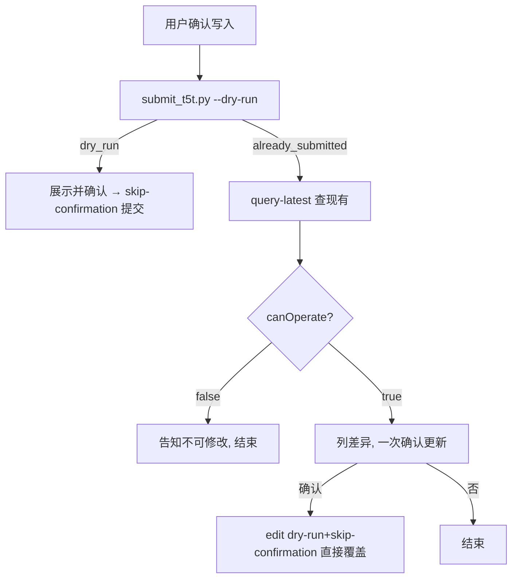

# T5T Skill 执行逻辑文档

> 本文档描述 `t5t-skill` 的完整执行逻辑，以及它依赖的 `im-teams-auth` 认证流程。
> 仅作开发参考；面向最终用户时禁止暴露环境名、token、Keyring 等内部细节。

配套文档：

- [CAPABILITIES.md](./CAPABILITIES.md)：面向使用者和调用方的简明能力清单。
- 本文档：面向维护者的执行流程、接口、状态和约束说明。

---

## 一、总览

`t5t-skill` 把散乱材料收敛成「最多 5 条、每条 ≤80 字、按优先级排序」的工作重点（Top 5 Things），并在用户确认后写入 360Teams T5T 系统。

两类核心动作：

- **新建**：填写下周可填写周期的 T5T。
- **查询/编辑**：查询最新已填写 T5T，按需修改正文、删除抄送人或切换同组可见。

此外支持：

- 基于周报、会议纪要、项目进展、客户反馈等材料生成或优化 T5T。
- 只读分页浏览最近 T5T。
- 使用 JSON 参数或内容文件提供新建、编辑内容。
- 在正式提交前生成 dry-run 和确认哈希，防止确认后内容或权限发生变化。
- 提交成功后返回 T5T 预览链接。

所有系统调用都经过认证。认证由独立的 `im-teams-auth` skill 接管，`t5t-skill` 只消费结果。

明确不支持：

- 无参考材料时编造 T5T。
- 修改非最新历史 T5T。
- 新建时新增、替换或构造抄送人。
- 编辑时新增、替换或修改抄送人对象；只允许删除已有抄送人。
- 跳过用户确认直接提交。

脚本分工：

| 脚本 | 职责 |
|------|------|
| `scripts/submit_t5t.py` | 查询可填写周期、新建 T5T |
| `scripts/edit_t5t.py` | 浏览最近 T5T（只读）、查询最新已填写 T5T、提交编辑 |
| `scripts/t5t_client.py` | 共享：认证、请求、解析、payload 组装、确认哈希（不可直接执行） |
| `scripts/config.py` | 静态配置：环境、域名、API 路径、Appkey、超时、依赖路径 |

---

## 二、配置（`scripts/config.py`）

| 项 | 值 |
|----|----|
| 默认环境 | `test`（`ACTIVE_ENVIRONMENT`，可被环境变量 `T5T_ENV` 临时覆盖） |
| production 域名 | `https://im.360teams.com` |
| test 域名 | `https://sit-im.360teams.com` |
| API 前缀 | `/api/qfin-api` |
| Appkey | `t5t`（固定） |
| 超时 | 30s |
| 认证失效退出码 | `4` |

接口路径：

| 用途 | Method | Path |
|------|--------|------|
| 周期列表 | GET | `/dgt/tft/weekly/report/list/query` |
| 最新/最近已填写列表 | GET | `/dgt/tft/im/self?pageNum=<n>&pageSize=<size>`（查最新固定 1/1；浏览可放大 pageSize） |
| 按 id 查详情 | GET | `/dgt/tft/weekly/report/queryById/{id}` |
| 历史抄送人 | GET | `/dgt/tft/weekly/report/latest/copies` |
| 提交（新建+编辑共用） | POST | `/dgt/tft/weekly/report/commit` |
| 预览页 | — | `/applink/page/t5t?...`（applink scheme） |

---

## 三、内容生成阶段（不涉及系统调用）

1. **判断输入来源**
   - 有参考材料 → 基于材料提炼，不编造。
   - 只给已有 T5T → 按要求改，保留原意。
   - 无材料 → 建议补充数据来源，不直接生成。
2. **生成准则**：最多 5 条 / 每条一句话 / ≤80 字 / 按优先级 / 真实客观 / 去琐碎。
3. **生成后必须询问是否写入系统**，默认不自动写入。即使用户一开始就要求写入，也要先展示待写入内容再确认。

校验在脚本侧强制（`t5t_client.extract_values`）：

- 超过 5 条 → 拒绝执行。
- 任一条 > 80 字 → 报错。
- 不足 5 条 → 提交时自动补空字符串（`_make_summary_items` 固定生成 5 项 `rawContent`）。

---

## 四、写入主流程：dry-run 先行

用户确认写入后，**第一次调用就是新建 dry-run**（脚本自身先查周期、不提交），无需单独 `--check`。按返回分支：

- `status: dry_run` → 存在可填写周期 → 进入【新建分支】确认提交。
- `status: already_submitted` → 周期已填、不能新建 → 用户本意是写新内容时，转「对比并更新」：查最新详情 → 列出现有内容 vs 新内容差异 → 一次确认更新意图 → 确认即直接覆盖（不二次确认），对用户措辞用“更新”。



> 内容是覆盖式更新（保留原抄送人/同组可见），但面向用户一律说“更新”，不说“覆盖/dry-run”。

> `--check` 仍可单独查周期，但常规写入不需要它（dry-run 已含周期检查），少一次往返。

---

## 五、新建分支（两阶段，必须二次确认）

### 阶段一：确认新建信息（dry-run，不提交）

写入流程的第一次脚本调用（无需先 `--check`）：

```bash
python3 scripts/submit_t5t.py --dry-run --items-json '<T5T JSON>'
```

脚本严格顺序（`submit_t5t.main`）：

1. 检查/获取 IM token（经 `im-teams-auth`，见第七节）。
2. **再次查询周期列表**（避免确认期间状态变化）。
3. 列表为空 → 输出 `already_submitted` 立即中断，不读内容、不查权限、不提交。
4. 列表非空 → 取第一个周期，查 `latest/copies` 历史抄送人。
5. 组装 `create` payload，计算 `confirmationHash`。
6. 输出 `status: dry_run` / `mode: create` / 周期 / 权限 / payload，**立即中断**。

代理把要提交的关键信息一次性展示清楚，作为唯一提交确认：

```text
即将提交：
周期：<周期名称>
内容：
1. ...
抄送人：<姓名和组织路径；没有则显示无抄送人>
同组可见：<同组可见 或 同组不可见>

确认提交吗？
```

> 同组可见默认 `true`，可选传 `--invite-same-group true|false` 覆盖；用户要求同组不可见时传 `false`。

### 阶段二：确认后提交

- 用户不确认 → 结束，不执行任何提交。
- 用户确认 → 从阶段一输出取 `payload.reportId` 与 `confirmationHash`：

```bash
python3 scripts/submit_t5t.py --skip-confirmation \
  --report-id '<已确认 reportId>' \
  --confirmation-hash '<confirmationHash>' \
  --open-preview \
  --items-json '<与阶段一相同的 T5T JSON>'
```

- `--skip-confirmation` 缺 `--report-id` 或 `--confirmation-hash` → 脚本拒绝提交。
- 脚本重算 `confirmationHash`，与传入值不一致 → 报「已确认信息发生变化，请重新查询并确认」并中断。
- 抄送人**只能原样使用 `latest/copies` 返回值**，不接受新增/替换/构造。
- 传过 `--invite-same-group` 时，正式提交必须带相同值，否则 `confirmationHash` 失配被拒。

提交成功后向用户展示：周期名、T5T 内容、权限、同组可见、`previewLink`（点击预览）。

---

## 六、查询编辑分支（三步，必须二次确认）

### 第〇步（可选）：只读浏览最近 T5T

用户只想「看看最近 N 条」时：

```bash
python3 scripts/edit_t5t.py --list-recent --page-size 5   # --page-num 默认 1
```

- 走 `query_self_weekly_list` → `/im/self?pageNum=<n>&pageSize=<size>`，经 `format_recent_item` 收敛成 `records`（`period`/`items`/`id`/`canOperate`），输出 `status: recent_list`。
- 纯只读，展示后结束。**修改仍只针对最新单条**，不基于列表历史条目改。

### 第一步：查询最新详情

```bash
python3 scripts/edit_t5t.py --query-latest
```

脚本流程（`query_latest_detail`）：

1. GET `/im/self?pageNum=1&pageSize=1`（查最新固定 1/1）取第一条的 `id`。
2. GET `/queryById/{id}` 查详情。
3. 输出 `status: latest_detail` / 周期 / 内容 / `toList` / 权限 / `inviteSameGroupView` / `canOperate` / 详情。
4. 列表为空 → 输出 `not_found`。

代理展示周期、内容、权限、同组可见后分支：

- `canOperate=false` → **明确告诉用户「该 T5T 当前不可修改」，展示周期/内容/抄送人/同组可见即结束**，不进入编辑。
- `canOperate=true` → 询问是否修改内容、删除现有抄送人，或切换同组可见。
- 用户只查不改 → 展示后结束。

### 第二步：确认编辑信息（dry-run）

`--id` 必须用详情返回的 `id`：

```bash
# 仅改内容
python3 scripts/edit_t5t.py --dry-run --id '<详情 id>' --items-json '<修改后完整 T5T JSON>'

# 仅删抄送人（传删除后的完整 toList）
python3 scripts/edit_t5t.py --dry-run --id '<详情 id>' --to-list-json '<删除后完整 toList JSON>'

# 仅切换同组可见
python3 scripts/edit_t5t.py --dry-run --id '<详情 id>' --invite-same-group false
```

抄送人规则（**只能删，不能加**，由 `validate_reduced_to_list` 强制）：

- `--to-list-json` 人数必须**严格少于**当前抄送人数；不删人就别传。
- 每个保留对象必须原样来自详情 `toList`，不得新增/重复/篡改。
- 用户要求**加抄送人** → 明确告知无可靠人员数据源，无法添加，不查询/猜测/构造。
- 不传 `--items-json` 保留原内容；不传 `--to-list-json` 保留原权限；不传 `--invite-same-group` 保留原同组可见；三者都不传 → 脚本拒绝。
- 内容 / 抄送人 / 同组可见可任意组合修改。

脚本重查详情、复用 `id`/周期/`updateStamp`，输出 `status: dry_run` / `mode: edit` / payload。代理展示修改后内容并问「是否确定提交修改？」

### 第三步：确认后提交

```bash
python3 scripts/edit_t5t.py --skip-confirmation \
  --id '<详情 id>' \
  --confirmation-hash '<编辑 dry-run 返回的 hash>' \
  --open-preview \
  --items-json '<与 dry-run 相同的完整 T5T JSON>'
```

- 删抄送人时正式提交必须带与 dry-run **完全相同**的 `--to-list-json`；只删人则不传 `--items-json`。
- 切换同组可见时，正式提交必须带与 dry-run **完全相同**的 `--invite-same-group`。
- 详情内容/权限/`updateStamp`/`canOperate`/用户修改内容发生变化 → `confirmationHash` 失配 → 中断重查。
- `build_edit_payload` 二次校验 `canOperate`，为 false 直接报错。

---

## 七、im-teams-auth 认证流程（被调用方）

`t5t-skill` 任何系统请求前都会经 `t5t_client.load_token` → `_ensure_im_teams_auth` 拉起认证。**认证策略完全由 `im-teams-auth` 定义**，`t5t-skill` 只转述其结果，不补充认证话术。

### 7.1 调用链

```
t5t_client.create_request_context
  → load_token(env)
      → _read_cached_token(env)              # 快路径：先直接读 环境变量/Keyring
          ├─ 命中有效 token → 直接返回（不 spawn auth 子进程）
          └─ 未命中/过期 → _ensure_im_teams_auth(env)
                              → auth.py --check（退 0 复用 / 退 4 拉认证）
                              → 再 _read_cached_token(env)
  → build_headers(token)                     # 注入 Authorization（裸 token，不加 Bearer）
```

token 读取优先级：环境变量 `IM_TEAMS_GATEWAY_TOKEN_<ENV>` > Keyring。环境变量 token 无本地过期时间。

> **快路径优化**：token 在 Keyring/环境变量里有效时，每次脚本调用直接复用，不再 spawn `auth.py --check` 子进程；只有缺失或过期才拉起认证。

### 7.2 认证流程（详见 im-teams-auth 文档）

完整认证时序图、receiver 契约、会话复用和安全设计，统一维护在 `im-teams-auth` 的 [docs/ARCHITECTURE.md](../../im-teams-auth/docs/ARCHITECTURE.md)（§四 认证流程），此处不重复。

t5t 侧只需知道：经上面 7.1 的调用链拉起认证，成功后从 Keyring 读 token 注入请求头；长期 token 不经页面→receiver 传输，只在脚本侧 HTTPS 兑换。

### 7.3 浏览器兜底链接

- 仅特定场景脚本才额外输出**可点击的 https/http 浏览器认证链接**（不带 scheme）。
- 代理拿到该链接 → 必须提示「请点击下面链接在浏览器完成认证」，不能只留在日志/工具输出。
- 默认视为**并行兜底提示**：若业务命令仍在执行，不得宣告「流程已暂停」。
- 只有脚本已结束且明确返回需中断的结果（退出码 4 + 已输出面向用户链接）时，才暂停等待用户。

### 7.4 Keyring 存储

| 项 | 值 |
|----|----|
| service | `im-teams-auth:production` / `im-teams-auth:test` |
| token key | `gateway_token` |
| expiry key | `gateway_token_expiry` |
| 默认过期 | 3 天 |
| 平台 | macOS Keychain / Windows Credential Manager |

> `auth.py` 启动即 `ensure_keyring()`：缺失时自动 `pip install keyring`，装不上直接返回错误，**不会先弹认证窗再在保存时失败**（避免白认证一次）。

### 7.5 退出码

| Code | 含义 |
|------|------|
| 0 | 成功 |
| 1 | 失败 |
| 4 | 认证过期或未认证 |

---

## 八、强约束清单

**环境保密**
- 禁止向最终用户提及/展示环境名、`ACTIVE_ENVIRONMENT`、`--env`、`test`、`production`、默认环境。
- 仅开发者明确要求排查配置时才讨论环境选择。

**流程安全**
- 任何新建/查询/编辑前必须先查询，禁止在确认可操作前组装 payload。
- 新建/编辑都必须二次确认，禁止跳过第二次用户确认。
- 周期列表为空时禁止继续新建、查历史抄送人、组装新建 payload。
- 新建两次调用必须同环境、同内容、同 `reportId`、同 `confirmationHash`。
- 编辑两次调用必须同环境、同 `id`、同修改内容、同权限参数、同 `confirmationHash`。

**抄送人**
- 新建：只能原样用 `latest/copies` 返回值。
- 编辑：只能删除详情 `toList` 已有人员，禁止新增/重复/替换/修改。
- 无可靠人员数据源，不能加抄送人。

**同组可见（`inviteSameGroupView`）**
- 默认 `true`；用户明确要求才改 `false`。
- 新建/编辑两次调用必须用相同的同组可见值（已纳入 `confirmationHash`）。

**字段/认证**
- payload 只能由脚本生成，禁止代理自行拼接。
- `Appkey` 固定 `t5t`；`Authorization` 用 `im-teams-auth` 原始 token，不加 `Bearer`。
- 禁止展示 `Authorization` 或完整 token。
- 禁止调用旧的 `teams-auth`。
- 认证文案不是 `t5t-skill` 职责，只转述 `im-teams-auth` 结果。

---

## 九、状态码速查

| 脚本 | status | 含义 | 下一步 |
|------|--------|------|--------|
| submit `--dry-run` | `dry_run` (create) | 新建待确认（写入第一步） | 展示内容/周期/抄送人/同组可见，问确认提交 |
| submit `--dry-run` | `already_submitted` | 周期已填 | 问是否查/改最新 |
| submit `--check` | `available`/`already_submitted` | 仅查周期（可选，非常规流程） | — |
| edit `--list-recent` | `recent_list` | 最近 N 条（只读） | 展示列表后结束 |
| edit `--query-latest` | `latest_detail` | 最新详情 | 按 canOperate 分支 |
| edit `--query-latest` | `not_found` | 无已填写 T5T | 结束 |
| edit `--dry-run` | `dry_run` (edit) | 编辑待确认 | 展示并问是否提交 |
| 任意 | `ok` | 提交成功 | 展示周期/内容/权限/同组可见/预览链接 |
| 任意 | `expired` (退出码 4) | 认证失效 | 走 im-teams-auth 认证 |
| 任意 | `error` | 业务错误 | 按 message 处理 |
